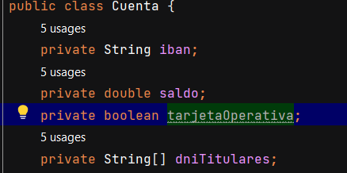

# EjercicioEntornosdeDesarollo Víctor Alarcón Codigo Clean

# 5 Ejemplos de Clean Code

## Primero: No te repitas y No pongas comentarios confusos

Ejemplo mal simplificado.

Ejemplo bien simplificado.

## Segundo: Nombres que den significado y mal implementacion de flag Arguments

Ejemplo mal nombrado y simplificado

Ejemplo bien nombrado y simplificado

## Tercero: Otra simplificación de Flag Arguments

Ejemplo mal simplificado

Ejemplo bien simplificado

## Cuarto: Sustitucion por funciones

Ejemplo mal implementado

Ejemplo bien implementado

## Quinto: Mal implementacion de Clases

Ejemplo de clase Vehiculo

Ejemplo de clase Vehiculo convertido a Clase Abstracta

 